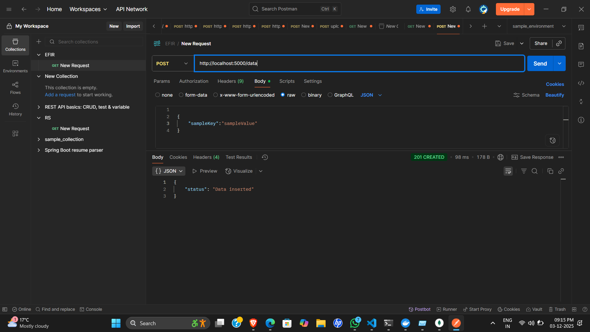

# FarAlpha_Assignment
# FarAlpha_Assignment

Project: Flask + MongoDB Deployment on Kubernetes (Minikube)

================================================================================
                     SCREENSHOTS
================================================================================

Screenshot 1: Postman API Testing
•⁠  ⁠Shows successful POST request to http://localhost:5000/data
•⁠  ⁠Request body: {"sampleKey": "sampleValue"}
•⁠  ⁠Response: 201 CREATED with {"status": "Data inserted"}
•⁠  ⁠Demonstrates Flask API working correctly

Screenshot 2: Deployment & Service Verification
•⁠  ⁠Docker image built successfully: flask-mongodb-app:latest
•⁠  ⁠All pods running in flask-mongo-ns namespace:
  * flask-app-7b46f8cb8d-6s9h5 (Running)
  * flask-app-7b46f8cb8d-m8jf7 (Running)
  * mongo-0 (Running)
•⁠  ⁠Service accessible at: http://127.0.0.1:49682
•⁠  ⁠Full deployment verified successfully

================================================================================
 1.⁠ ⁠Dockerfile (Flask Application)
================================================================================

FROM python:3.11-slim

WORKDIR /app

COPY requirements.txt .
RUN pip install --no-cache-dir -r requirements.txt

COPY . .

EXPOSE 5000
CMD ["python", "app.py"]

================================================================================
 2.⁠ ⁠Instructions to Build and Push Docker Image
================================================================================

Build Docker image:
docker build -t flask-mongodb-app:latest .

Tag for Docker Hub:
docker tag flask-mongodb-app:latest <dockerhub-username>/flask-mongodb-app:latest

Login:
docker login

Push:
docker push <dockerhub-username>/flask-mongodb-app:latest

================================================================================
 3.⁠ ⁠Kubernetes YAML Files
================================================================================

3.1 namespace.yaml
------------------
apiVersion: v1
kind: Namespace
metadata:
  name: flask-mongo-ns

3.2 mongo-secret.yaml
---------------------
apiVersion: v1
kind: Secret
metadata:
  name: mongo-secret
  namespace: flask-mongo-ns
type: Opaque
stringData:
  MONGO_INITDB_ROOT_USERNAME: admin
  MONGO_INITDB_ROOT_PASSWORD: AdminPass123
  APP_DB_USER: appuser
  APP_DB_PASS: AppPass123

3.3 mongo-headless-svc.yaml
----------------------------
apiVersion: v1
kind: Service
metadata:
  name: mongo-headless
  namespace: flask-mongo-ns
spec:
  clusterIP: None
  selector:
    app: mongo
  ports:
    - port: 27017
      name: mongodb

3.4 mongo-statefulset.yaml
---------------------------
apiVersion: apps/v1
kind: StatefulSet
metadata:
  name: mongo
  namespace: flask-mongo-ns
spec:
  serviceName: "mongo-headless"
  replicas: 1
  selector:
    matchLabels:
      app: mongo
  template:
    metadata:
      labels:
        app: mongo
    spec:
      containers:
      - name: mongo
        image: mongo:6.0
        ports:
        - containerPort: 27017
        env:
        - name: MONGO_INITDB_ROOT_USERNAME
          valueFrom:
            secretKeyRef:
              name: mongo-secret
              key: MONGO_INITDB_ROOT_USERNAME
        - name: MONGO_INITDB_ROOT_PASSWORD
          valueFrom:
            secretKeyRef:
              name: mongo-secret
              key: MONGO_INITDB_ROOT_PASSWORD
        volumeMounts:
        - name: mongo-data
          mountPath: /data/db
        resources:
          requests:
            cpu: "0.2"
            memory: "250Mi"
          limits:
            cpu: "0.5"
            memory: "500Mi"
  volumeClaimTemplates:
  - metadata:
      name: mongo-data
    spec:
      accessModes: ["ReadWriteOnce"]
      resources:
        requests:
          storage: 5Gi

3.5 mongo-clusterip-svc.yaml
-----------------------------
apiVersion: v1
kind: Service
metadata:
  name: mongo-svc
  namespace: flask-mongo-ns
spec:
  selector:
    app: mongo
  ports:
    - port: 27017
      targetPort: 27017
  type: ClusterIP

3.6 flask-deployment.yaml
--------------------------
apiVersion: apps/v1
kind: Deployment
metadata:
  name: flask-app
  namespace: flask-mongo-ns
spec:
  replicas: 2
  selector:
    matchLabels:
      app: flask-app
  template:
    metadata:
      labels:
        app: flask-app
    spec:
      containers:
      - name: flask
        image: flask-mongodb-app:latest
        ports:
        - containerPort: 5000
        env:
        - name: MONGO_HOST
          value: "mongo-svc"
        - name: MONGO_PORT
          value: "27017"
        - name: MONGO_DB
          value: "flask_db"
        - name: MONGO_USER
          valueFrom:
            secretKeyRef:
              name: mongo-secret
              key: MONGO_INITDB_ROOT_USERNAME
        - name: MONGO_PASS
          valueFrom:
            secretKeyRef:
              name: mongo-secret
              key: MONGO_INITDB_ROOT_PASSWORD
        resources:
          requests:
            cpu: "0.2"
            memory: "250Mi"
          limits:
            cpu: "0.5"
            memory: "500Mi"

3.7 flask-service.yaml
-----------------------
apiVersion: v1
kind: Service
metadata:
  name: flask-service
  namespace: flask-mongo-ns
spec:
  selector:
    app: flask-app
  type: NodePort
  ports:
    - port: 5000
      targetPort: 5000
      nodePort: 30080

3.8 hpa.yaml
-------------
apiVersion: autoscaling/v2
kind: HorizontalPodAutoscaler
metadata:
  name: flask-hpa
  namespace: flask-mongo-ns
spec:
  scaleTargetRef:
    apiVersion: apps/v1
    kind: Deployment
    name: flask-app
  minReplicas: 2
  maxReplicas: 5
  metrics:
  - type: Resource
    resource:
      name: cpu
      target:
        type: Utilization
        averageUtilization: 70

================================================================================
 4.⁠ ⁠Deployment Steps (Minikube)
================================================================================

4.1 Start Minikube
------------------
minikube start --memory=8192 --cpus=4
minikube addons enable metrics-server

4.2 Build Docker image inside Minikube
---------------------------------------
& minikube -p minikube docker-env --shell powershell | Invoke-Expression
docker build -t flask-mongodb-app:latest .

4.3 Apply Kubernetes manifests
-------------------------------
kubectl apply -f k8s/namespace.yaml
kubectl apply -n flask-mongo-ns -f k8s/mongo-secret.yaml
kubectl apply -n flask-mongo-ns -f k8s/mongo-headless-svc.yaml
kubectl apply -n flask-mongo-ns -f k8s/mongo-statefulset.yaml
kubectl apply -n flask-mongo-ns -f k8s/mongo-clusterip-svc.yaml
kubectl apply -n flask-mongo-ns -f k8s/flask-deployment.yaml
kubectl apply -n flask-mongo-ns -f k8s/flask-service.yaml
kubectl apply -n flask-mongo-ns -f hpa.yaml

4.4 Verify Deployment
----------------------
kubectl get pods -n flask-mongo-ns

Expected Output:
NAME                        READY   STATUS    RESTARTS   AGE
flask-app-7b46f8cb8d-6s9h5  1/1     Running   0          12m
flask-app-7b46f8cb8d-m8jf7  1/1     Running   0          12m
mongo-0                     1/1     Running   0          12m

4.5 Access Flask Application
-----------------------------
minikube service flask-service -n flask-mongo-ns --url

Output: http://127.0.0.1:49682 (port may vary)

================================================================================
 5.⁠ ⁠DNS Resolution in Kubernetes
================================================================================

Service DNS Format:
<service-name>.<namespace>.svc.cluster.local

Flask connects to MongoDB using:
mongo-svc.flask-mongo-ns.svc.cluster.local

How it works:
•⁠  ⁠CoreDNS inside the cluster resolves the hostname to the Service's ClusterIP
•⁠  ⁠Enables inter-pod communication without knowing IP addresses
•⁠  ⁠Service discovery is automatic and dynamic

================================================================================
 6.⁠ ⁠Resource Requests and Limits
================================================================================

Requests:
•⁠  ⁠Minimum resources guaranteed for a container
•⁠  ⁠Scheduler places pods only on nodes that can satisfy requests

Limits:
•⁠  ⁠Maximum resources a container is allowed to use
•⁠  ⁠Prevents one app from consuming all node resources

Configuration Used:
requests:
  cpu: 0.2
  memory: 250Mi
limits:
  cpu: 0.5
  memory: 500Mi

================================================================================
 7.⁠ ⁠Design Choices
================================================================================

StatefulSet for MongoDB
•⁠  ⁠Provides stable network identity and persistent storage
•⁠  ⁠Required for stateful applications like databases
•⁠  ⁠Ensures data persistence across pod restarts

Deployment for Flask
•⁠  ⁠Stateless application - perfect for horizontal scaling
•⁠  ⁠Easy to update and rollback
•⁠  ⁠Multiple replicas for high availability

ClusterIP for MongoDB
•⁠  ⁠Access restricted to internal cluster components only
•⁠  ⁠Enhances security by not exposing database externally

NodePort for Flask
•⁠  ⁠Allows access from local machine for testing
•⁠  ⁠Port 30080 accessible via minikube service command

HPA with CPU Metrics
•⁠  ⁠Automatically scales Flask pods based on CPU utilization
•⁠  ⁠Maintains performance under varying loads
•⁠  ⁠Scales between 2-5 replicas

Secrets for MongoDB Credentials
•⁠  ⁠Sensitive information stored securely
•⁠  ⁠Credentials injected as environment variables
•⁠  ⁠Base64 encoded in Kubernetes

================================================================================
 8.⁠ ⁠Testing Scenarios
================================================================================

8.1 Database Operations Test
-----------------------------
Insert Data:
curl -X POST http://127.0.0.1:49682/data -H "Content-Type: application/json" -d '{"name":"Boss"}'

Expected Response:
{"status": "Data inserted"}

Fetch Data:
curl http://127.0.0.1:49682/data

Result: Records persisted successfully across requests

8.2 Autoscaling Test
---------------------
Generate Load:
kubectl run load-generator -n flask-mongo-ns --image=busybox -- /bin/sh -c "while true; do wget -qO- http://flask-service:5000/; done"

Monitor HPA:
kubectl get hpa -n flask-mongo-ns -w

Expected Behavior:
•⁠  ⁠CPU utilization increases above 70%
•⁠  ⁠Replicas scale up from 2 towards maximum of 5
•⁠  ⁠Additional pods are automatically created

Stop Load:
kubectl delete pod load-generator -n flask-mongo-ns

8.3 Persistence Test
---------------------
Delete MongoDB Pod:
kubectl delete pod mongo-0 -n flask-mongo-ns

Verify Data Integrity:
curl http://127.0.0.1:49682/data

Result:
•⁠  ⁠Pod automatically recreates (StatefulSet behavior)
•⁠  ⁠Data remains intact due to PersistentVolumeClaim
•⁠  ⁠No data loss occurred

8.4 Multi-Replica Test
-----------------------
Check Flask Replicas:
kubectl get pods -n flask-mongo-ns -l app=flask-app

Verify Load Distribution:
•⁠  ⁠Both Flask pods should be Running
•⁠  ⁠Requests distributed across replicas
•⁠  ⁠High availability confirmed

================================================================================
 9.⁠ ⁠Verification Checklist
================================================================================

✓ Docker image built successfully
✓ All Kubernetes resources created
✓ MongoDB pod running with persistent storage
✓ Flask deployment with 2 replicas running
✓ Service accessible via minikube tunnel
✓ API endpoints responding correctly (201 CREATED)
✓ Data persistence verified
✓ HPA configured and monitoring CPU
✓ Secrets properly injected into pods
✓ DNS resolution working for inter-service communication

================================================================================
10.⁠ ⁠Common Commands
================================================================================

View all resources in namespace:
kubectl get all -n flask-mongo-ns

View pod logs:
kubectl logs -f <pod-name> -n flask-mongo-ns

Describe a resource:
kubectl describe pod <pod-name> -n flask-mongo-ns

Check HPA status:
kubectl get hpa -n flask-mongo-ns

Access MongoDB shell:
kubectl exec -it mongo-0 -n flask-mongo-ns -- mongosh -u admin -p AdminPass123

Delete all resources:
kubectl delete namespace flask-mongo-ns

Stop Minikube:
minikube stop

================================================================================
END OF README
================================================================================
